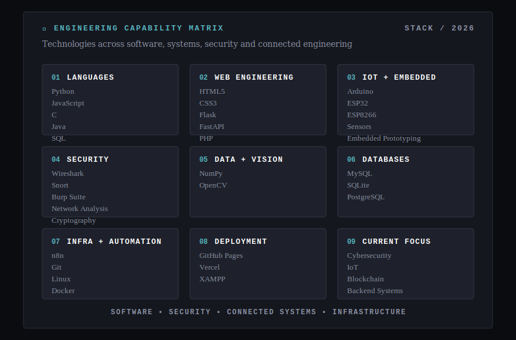
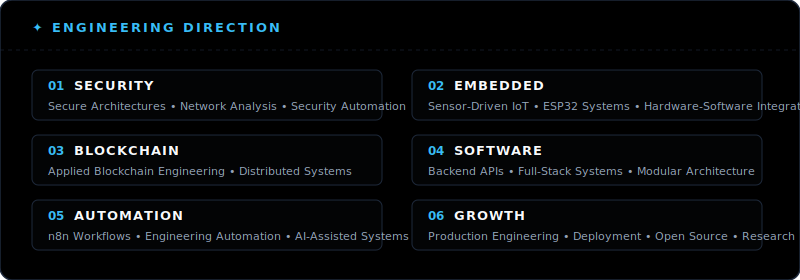
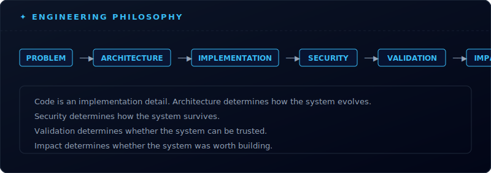
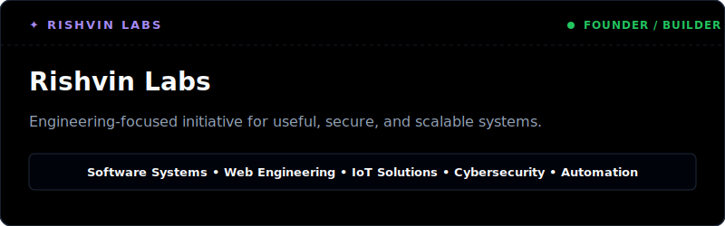
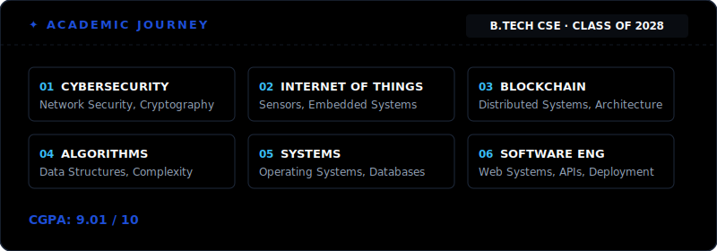
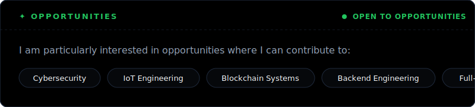
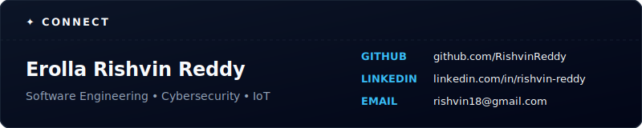

# Rishvin Reddy

<picture>
  <source
    media="(prefers-color-scheme: dark)"
    srcset="./dark_mode.svg"
  />
  <source
    media="(prefers-color-scheme: light)"
    srcset="./light_mode.svg"
  />
  
</picture>

⸻

## ✦ About Me

<picture>
  <source
    media="(prefers-color-scheme: dark)"
    srcset="./assets/about_dark.svg"
  />
  <source
    media="(prefers-color-scheme: light)"
    srcset="./assets/about_light.svg"
  />
  
</picture>

⸻

## ✦ Tech Stack

<picture>
  <source media="(prefers-color-scheme: dark)" srcset="./assets/cards/tech_stack_dark.svg">
  <source media="(prefers-color-scheme: light)" srcset="./assets/cards/tech_stack_light.svg">
  
</picture>

⸻

## ✦ Selected Engineering Projects

<!-- STARRED_REPOS_START -->
## ✦ Featured Projects
<table>
<tr>
<td width="50%" valign="top">
<a href="https://github.com/RishvinReddy/rishvinreddy.github.io">
<picture>
  <source media="(prefers-color-scheme: dark)" srcset="./assets/projects/project-rishvinreddy-github-io-dark.svg">
  <source media="(prefers-color-scheme: light)" srcset="./assets/projects/project-rishvinreddy-github-io-light.svg">
  
</picture>
</a>
</td>
<td width="50%" valign="top">
<a href="https://github.com/RishvinReddy/AI-Security-Guardian">
<picture>
  <source media="(prefers-color-scheme: dark)" srcset="./assets/projects/project-ai-security-guardian-dark.svg">
  <source media="(prefers-color-scheme: light)" srcset="./assets/projects/project-ai-security-guardian-light.svg">
  
</picture>
</a>
</td>
</tr>
<tr>
<td width="50%" valign="top">
<a href="https://github.com/RishvinReddy/HandMatrix">
<picture>
  <source media="(prefers-color-scheme: dark)" srcset="./assets/projects/project-handmatrix-dark.svg">
  <source media="(prefers-color-scheme: light)" srcset="./assets/projects/project-handmatrix-light.svg">
  
</picture>
</a>
</td>
<td width="50%" valign="top">
<a href="https://github.com/RishvinReddy/Smart-cart-os">
<picture>
  <source media="(prefers-color-scheme: dark)" srcset="./assets/projects/project-smart-cart-os-dark.svg">
  <source media="(prefers-color-scheme: light)" srcset="./assets/projects/project-smart-cart-os-light.svg">
  
</picture>
</a>
</td>
</tr>
<tr>
<td width="50%" valign="top">
<a href="https://github.com/RishvinReddy/Biometric-Voting-System">
<picture>
  <source media="(prefers-color-scheme: dark)" srcset="./assets/projects/project-biometric-voting-system-dark.svg">
  <source media="(prefers-color-scheme: light)" srcset="./assets/projects/project-biometric-voting-system-light.svg">
  
</picture>
</a>
</td>
<td width="50%" valign="top">
<a href="https://github.com/RishvinReddy/Face-Mesh-Verification-System">
<picture>
  <source media="(prefers-color-scheme: dark)" srcset="./assets/projects/project-face-mesh-verification-system-dark.svg">
  <source media="(prefers-color-scheme: light)" srcset="./assets/projects/project-face-mesh-verification-system-light.svg">
  
</picture>
</a>
</td>
</tr>
<tr>
<td width="50%" valign="top">
<a href="https://github.com/RishvinReddy/Interactive-Disk-Scheduling-Algorithm-Visualizer">
<picture>
  <source media="(prefers-color-scheme: dark)" srcset="./assets/projects/project-interactive-disk-scheduling-algorithm-visualizer-dark.svg">
  <source media="(prefers-color-scheme: light)" srcset="./assets/projects/project-interactive-disk-scheduling-algorithm-visualizer-light.svg">
  
</picture>
</a>
</td>
<td width="50%" valign="top">
<a href="https://github.com/RishvinReddy/Gov-Payroll-System">
<picture>
  <source media="(prefers-color-scheme: dark)" srcset="./assets/projects/project-gov-payroll-system-dark.svg">
  <source media="(prefers-color-scheme: light)" srcset="./assets/projects/project-gov-payroll-system-light.svg">
  
</picture>
</a>
</td>
</tr>
</table>
<!-- STARRED_REPOS_END -->

⸻

## ✦ Current Engineering Direction

<picture>
  <source media="(prefers-color-scheme: dark)" srcset="./assets/cards/engineering_direction_dark.svg">
  <source media="(prefers-color-scheme: light)" srcset="./assets/cards/engineering_direction_light.svg">
  
</picture>

⸻

## ✦ GitHub Analytics

 

⸻

## ✦ Engineering Philosophy

<picture>
  <source media="(prefers-color-scheme: dark)" srcset="./assets/cards/engineering_philosophy_dark.svg">
  <source media="(prefers-color-scheme: light)" srcset="./assets/cards/engineering_philosophy_light.svg">
  
</picture>

 

⸻

## ✦ Founder & Builder

<picture>
  <source media="(prefers-color-scheme: dark)" srcset="./assets/cards/rishvin_labs_dark.svg">
  <source media="(prefers-color-scheme: light)" srcset="./assets/cards/rishvin_labs_light.svg">
  
</picture>

 

⸻

## ✦ Academic Journey

<picture>
  <source media="(prefers-color-scheme: dark)" srcset="./assets/cards/academic_journey_dark.svg">
  <source media="(prefers-color-scheme: light)" srcset="./assets/cards/academic_journey_light.svg">
  
</picture>

 

⸻

## ✦ Open To

<picture>
  <source media="(prefers-color-scheme: dark)" srcset="./assets/cards/open_to_dark.svg">
  <source media="(prefers-color-scheme: light)" srcset="./assets/cards/open_to_light.svg">
  
</picture>

 

⸻

## ✦ Connect

<picture>
  <source media="(prefers-color-scheme: dark)" srcset="./assets/cards/connect_dark.svg">
  <source media="(prefers-color-scheme: light)" srcset="./assets/cards/connect_light.svg">
  
</picture>

 

⸻

Secure systems. Scalable engineering. Real-world impact.

 

