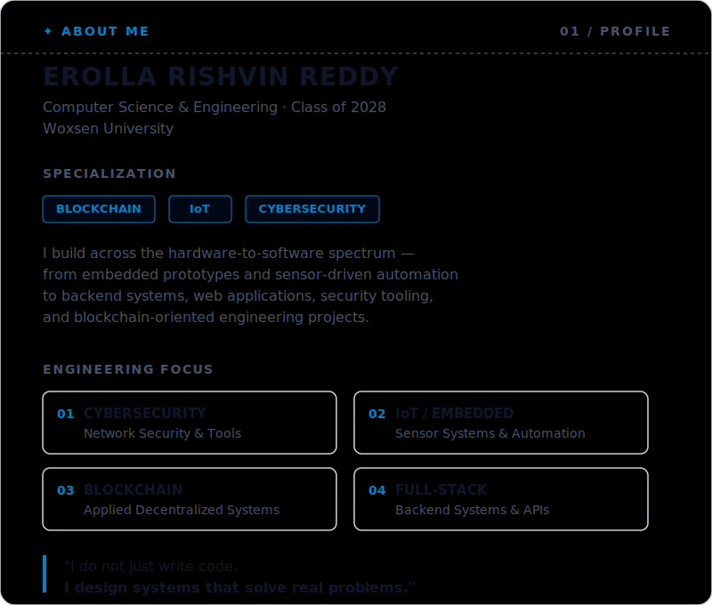
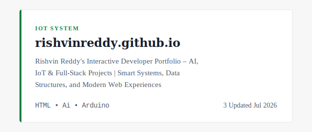
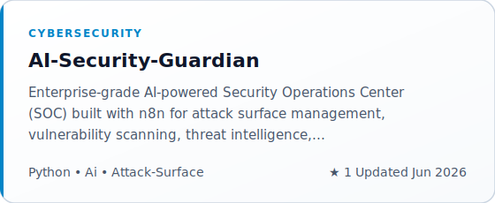
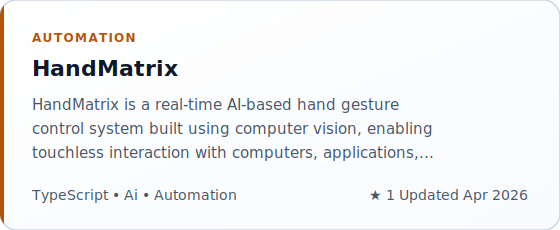
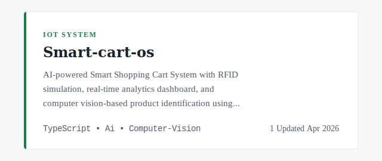
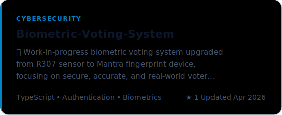
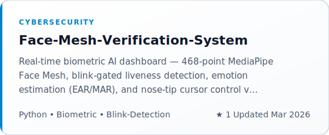
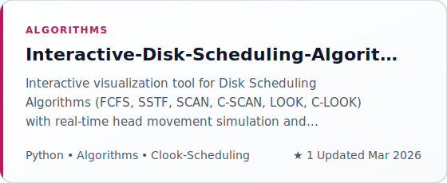
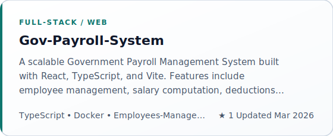

# Rishvin Reddy


<div align="center">

</div>
<div align="center">

</div>
<br>
<div align="center">
</div>

⸻

## ✦ About Me

<div align="center">
<picture>
  <source
    media="(prefers-color-scheme: dark)"
    srcset="./assets/about_dark.svg"
  />
  <source
    media="(prefers-color-scheme: light)"
    srcset="./assets/about_light.svg"
  />
  
</picture>
</div>

⸻

## ✦ Tech Stack

**Programming Languages**

<div align="center">


</div>

**Backend & Web Engineering**

<div align="center">


</div>

**IoT & Embedded Systems**

<div align="center">


</div>

**Cybersecurity & Networking**

<div align="center">


</div>

**Data, Computer Vision & Intelligent Systems**

<div align="center">


</div>

**Databases, Automation & Infrastructure**

<div align="center">


</div>

**Development & Deployment**

<div align="center">


</div>

⸻

## ✦ Selected Engineering Projects

<!-- STARRED_REPOS_START -->
## ✦ Featured Projects
<table>
<tr>
<td width="50%" valign="top">
<a href="https://github.com/RishvinReddy/rishvinreddy.github.io">
<picture>
  <source media="(prefers-color-scheme: dark)" srcset="./assets/projects/project-rishvinreddy-github-io-dark.svg">
  <source media="(prefers-color-scheme: light)" srcset="./assets/projects/project-rishvinreddy-github-io-light.svg">
  
</picture>
</a>
</td>
<td width="50%" valign="top">
<a href="https://github.com/RishvinReddy/AI-Security-Guardian">
<picture>
  <source media="(prefers-color-scheme: dark)" srcset="./assets/projects/project-ai-security-guardian-dark.svg">
  <source media="(prefers-color-scheme: light)" srcset="./assets/projects/project-ai-security-guardian-light.svg">
  
</picture>
</a>
</td>
</tr>
<tr>
<td width="50%" valign="top">
<a href="https://github.com/RishvinReddy/HandMatrix">
<picture>
  <source media="(prefers-color-scheme: dark)" srcset="./assets/projects/project-handmatrix-dark.svg">
  <source media="(prefers-color-scheme: light)" srcset="./assets/projects/project-handmatrix-light.svg">
  
</picture>
</a>
</td>
<td width="50%" valign="top">
<a href="https://github.com/RishvinReddy/Smart-cart-os">
<picture>
  <source media="(prefers-color-scheme: dark)" srcset="./assets/projects/project-smart-cart-os-dark.svg">
  <source media="(prefers-color-scheme: light)" srcset="./assets/projects/project-smart-cart-os-light.svg">
  
</picture>
</a>
</td>
</tr>
<tr>
<td width="50%" valign="top">
<a href="https://github.com/RishvinReddy/Biometric-Voting-System">
<picture>
  <source media="(prefers-color-scheme: dark)" srcset="./assets/projects/project-biometric-voting-system-dark.svg">
  <source media="(prefers-color-scheme: light)" srcset="./assets/projects/project-biometric-voting-system-light.svg">
  
</picture>
</a>
</td>
<td width="50%" valign="top">
<a href="https://github.com/RishvinReddy/Face-Mesh-Verification-System">
<picture>
  <source media="(prefers-color-scheme: dark)" srcset="./assets/projects/project-face-mesh-verification-system-dark.svg">
  <source media="(prefers-color-scheme: light)" srcset="./assets/projects/project-face-mesh-verification-system-light.svg">
  
</picture>
</a>
</td>
</tr>
<tr>
<td width="50%" valign="top">
<a href="https://github.com/RishvinReddy/Interactive-Disk-Scheduling-Algorithm-Visualizer">
<picture>
  <source media="(prefers-color-scheme: dark)" srcset="./assets/projects/project-interactive-disk-scheduling-algorithm-visualizer-dark.svg">
  <source media="(prefers-color-scheme: light)" srcset="./assets/projects/project-interactive-disk-scheduling-algorithm-visualizer-light.svg">
  
</picture>
</a>
</td>
<td width="50%" valign="top">
<a href="https://github.com/RishvinReddy/Gov-Payroll-System">
<picture>
  <source media="(prefers-color-scheme: dark)" srcset="./assets/projects/project-gov-payroll-system-dark.svg">
  <source media="(prefers-color-scheme: light)" srcset="./assets/projects/project-gov-payroll-system-light.svg">
  
</picture>
</a>
</td>
</tr>
</table>
<!-- STARRED_REPOS_END -->


⸻

## ✦ Current Engineering Direction

<div align="center">
<table>
  <tr>
    <td align="center" width="180"><strong>🔐 Security</strong></td>
    <td>Secure Architectures • Network Analysis • Security Automation • Threat-Aware Systems</td>
  </tr>
  <tr>
    <td align="center"><strong>🔌 Embedded</strong></td>
    <td>Sensor-Driven IoT • ESP32 Systems • Hardware-Software Integration</td>
  </tr>
  <tr>
    <td align="center"><strong>⛓️ Blockchain</strong></td>
    <td>Applied Blockchain Engineering • Distributed Systems • Secure Digital Infrastructure</td>
  </tr>
  <tr>
    <td align="center"><strong>🌐 Software</strong></td>
    <td>Backend APIs • Full-Stack Systems • Modular Architecture • Database Engineering</td>
  </tr>
  <tr>
    <td align="center"><strong>⚙️ Automation</strong></td>
    <td>n8n Workflows • Engineering Automation • AI-Assisted Systems</td>
  </tr>
  <tr>
    <td align="center"><strong>📈 Growth</strong></td>
    <td>Production Engineering • Deployment • Open Source • Research • Industry Readiness</td>
  </tr>
</table>
</div>

⸻

## ✦ GitHub Analytics

<div align="center">


<p>


</p>
<p>


</p>
<br/>


</div>

⸻

## ✦ Engineering Philosophy

Problem → Architecture → Implementation → Security → Validation → Impact
```
┌───────────────────────────────────────────────────────────────┐
│  Code is an implementation detail.                            │
│  Architecture determines how the system evolves.              │
│  Security determines how the system survives.                 │
│  Validation determines whether the system can be trusted.     │
│  Impact determines whether the system was worth building.     │
└───────────────────────────────────────────────────────────────┘
```

My approach is grounded in a few principles:

* Build for real use cases, not only demonstrations
* Treat security as an architectural concern
* Prefer clear systems over unnecessary complexity
* Connect hardware, software, data, and infrastructure intentionally
* Document engineering decisions
* Measure progress through shipped work

⸻

## ✦ Founder & Builder

<div align="center">

### Rishvin Labs

I am building Rishvin Labs as an engineering-focused initiative working across:

Software Systems • Web Engineering • IoT Solutions • Cybersecurity • Automation

The objective is to turn technical capability into useful, secure, and scalable systems for real-world applications.

</div>

⸻

## ✦ Academic Journey

<div align="center">
<details>
<summary><b>🎓 B.Tech CSE @ Woxsen University — Class of 2028</b></summary>
<br/>
<table>
<tr>
<td align="center" width="220">
<strong>🔐 Cybersecurity</strong><br/>
Network Security • Cryptography • Threat Analysis • Secure Systems
</td>
<td align="center" width="220">
<strong>🔌 Internet of Things</strong><br/>
Sensors • Embedded Systems • Automation • Connected Devices
</td>
</tr>
<tr>
<td align="center">
<strong>⛓️ Blockchain</strong><br/>
Distributed Systems • Blockchain Architecture • Applied Decentralization
</td>
<td align="center">
<strong>📊 Algorithms</strong><br/>
Data Structures • Search • Pattern Matching • Complexity
</td>
</tr>
<tr>
<td align="center">
<strong>⚙️ Systems</strong><br/>
Operating Systems • Databases • Computer Networks
</td>
<td align="center">
<strong>🌐 Software Engineering</strong><br/>
Web Systems • Backend Logic • APIs • Deployment
</td>
</tr>
</table>
<br/>
</details>
</div>

⸻

## ✦ Open To

I am particularly interested in opportunities involving:

Cybersecurity • IoT • Blockchain • Backend Engineering • Full-Stack Systems • Engineering Automation

⸻

## ✦ Connect

<div align="center">

[](https://linkedin.com/in/rishvin-reddy)
[](mailto:rishvin18@gmail.com)
[](https://wa.me/message/J4P3MRT5HOAZH1)
[](https://github.com/RishvinReddy)

</div>

⸻

<div align="center">

Secure systems. Scalable engineering. Real-world impact.


</div>
