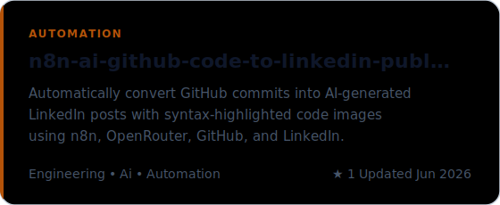
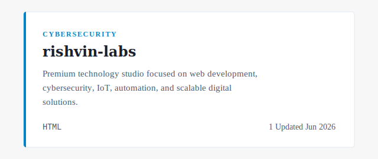
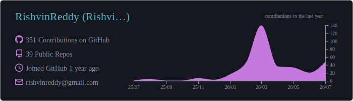
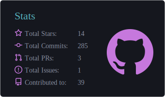
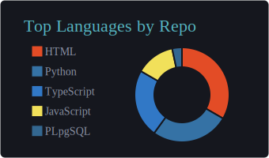
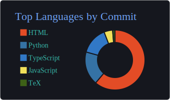
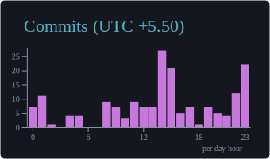

# Rishvin Reddy
<picture>
  <source
    media="(prefers-color-scheme: dark)"
    srcset="./dark_mode.svg?v=2"
  />
  <source
    media="(prefers-color-scheme: light)"
    srcset="./light_mode.svg?v=2"
  />
  
</picture>

⸻

## ✦ About Me

<picture>
  <source media="(prefers-color-scheme: dark)" srcset="./assets/about_dark.svg?v=2">
  <source media="(prefers-color-scheme: light)" srcset="./assets/about_light.svg?v=2">
  
</picture>

⸻

## ✦ Engineering Profile

<picture>
  <source media="(prefers-color-scheme: dark)" srcset="./assets/cards/engineering_profile_dark.svg?v=2">
  <source media="(prefers-color-scheme: light)" srcset="./assets/cards/engineering_profile_light.svg?v=2">
  
</picture>

 

⸻

## ✦ What I Build

<picture>
  <source media="(prefers-color-scheme: dark)" srcset="./assets/cards/what_i_build_dark.svg?v=2">
  <source media="(prefers-color-scheme: light)" srcset="./assets/cards/what_i_build_light.svg?v=2">
  
</picture>

 

⸻

## ✦ Technical Domains

<picture>
  <source media="(prefers-color-scheme: dark)" srcset="./assets/cards/technical_domains_dark.svg?v=2">
  <source media="(prefers-color-scheme: light)" srcset="./assets/cards/technical_domains_light.svg?v=2">
  
</picture>

 

⸻

## ✦ Tech Stack

<picture>
  <source media="(prefers-color-scheme: dark)" srcset="./assets/cards/tech_stack_dark.svg?v=2">
  <source media="(prefers-color-scheme: light)" srcset="./assets/cards/tech_stack_light.svg?v=2">
  
</picture>

⸻

## ✦ Selected Engineering Projects

<!-- STARRED_REPOS_START -->
## ✦ Featured Projects
<table>
<tr>
<td width="50%" valign="top">
<a href="https://github.com/RishvinReddy/rishvinreddy.github.io">
<picture>
  <source media="(prefers-color-scheme: dark)" srcset="./assets/projects/project-rishvinreddy-github-io-dark.svg">
  <source media="(prefers-color-scheme: light)" srcset="./assets/projects/project-rishvinreddy-github-io-light.svg">
  
</picture>
</a>
</td>
<td width="50%" valign="top">
<a href="https://github.com/RishvinReddy/AI-Security-Guardian">
<picture>
  <source media="(prefers-color-scheme: dark)" srcset="./assets/projects/project-ai-security-guardian-dark.svg">
  <source media="(prefers-color-scheme: light)" srcset="./assets/projects/project-ai-security-guardian-light.svg">
  
</picture>
</a>
</td>
</tr>
<tr>
<td width="50%" valign="top">
<a href="https://github.com/RishvinReddy/n8n-ai-github-code-to-linkedin-publisher">
<picture>
  <source media="(prefers-color-scheme: dark)" srcset="./assets/projects/project-n8n-ai-github-code-to-linkedin-publisher-dark.svg">
  <source media="(prefers-color-scheme: light)" srcset="./assets/projects/project-n8n-ai-github-code-to-linkedin-publisher-light.svg">
  
</picture>
</a>
</td>
<td width="50%" valign="top">
<a href="https://github.com/RishvinReddy/rishvin-labs">
<picture>
  <source media="(prefers-color-scheme: dark)" srcset="./assets/projects/project-rishvin-labs-dark.svg">
  <source media="(prefers-color-scheme: light)" srcset="./assets/projects/project-rishvin-labs-light.svg">
  
</picture>
</a>
</td>
</tr>
<tr>
<td width="50%" valign="top">
<a href="https://github.com/RishvinReddy/HandMatrix">
<picture>
  <source media="(prefers-color-scheme: dark)" srcset="./assets/projects/project-handmatrix-dark.svg">
  <source media="(prefers-color-scheme: light)" srcset="./assets/projects/project-handmatrix-light.svg">
  
</picture>
</a>
</td>
<td width="50%" valign="top">
<a href="https://github.com/RishvinReddy/Smart-cart-os">
<picture>
  <source media="(prefers-color-scheme: dark)" srcset="./assets/projects/project-smart-cart-os-dark.svg">
  <source media="(prefers-color-scheme: light)" srcset="./assets/projects/project-smart-cart-os-light.svg">
  
</picture>
</a>
</td>
</tr>
<tr>
<td width="50%" valign="top">
<a href="https://github.com/RishvinReddy/Biometric-Voting-System">
<picture>
  <source media="(prefers-color-scheme: dark)" srcset="./assets/projects/project-biometric-voting-system-dark.svg">
  <source media="(prefers-color-scheme: light)" srcset="./assets/projects/project-biometric-voting-system-light.svg">
  
</picture>
</a>
</td>
<td width="50%" valign="top">
<a href="https://github.com/RishvinReddy/Face-Mesh-Verification-System">
<picture>
  <source media="(prefers-color-scheme: dark)" srcset="./assets/projects/project-face-mesh-verification-system-dark.svg">
  <source media="(prefers-color-scheme: light)" srcset="./assets/projects/project-face-mesh-verification-system-light.svg">
  
</picture>
</a>
</td>
</tr>
</table>
<!-- STARRED_REPOS_END -->

## ✦ Current Engineering Direction

<picture>
  <source media="(prefers-color-scheme: dark)" srcset="./assets/cards/engineering_direction_dark.svg?v=2">
  <source media="(prefers-color-scheme: light)" srcset="./assets/cards/engineering_direction_light.svg?v=2">
  
</picture>

⸻

## ✦ GitHub Analytics

<picture>
  <source media="(prefers-color-scheme: dark)" srcset="./assets/analytics/views_dark.svg">
  <source media="(prefers-color-scheme: light)" srcset="./assets/analytics/views_light.svg">
  
</picture>
  
<picture>
  <source media="(prefers-color-scheme: dark)" srcset="./assets/analytics/profile_details_dark.svg">
  <source media="(prefers-color-scheme: light)" srcset="./assets/analytics/profile_details_light.svg">
  
</picture>

<picture>
  <source media="(prefers-color-scheme: dark)" srcset="./assets/analytics/stats_dark.svg">
  <source media="(prefers-color-scheme: light)" srcset="./assets/analytics/stats_light.svg">
  
</picture>
<picture>
  <source media="(prefers-color-scheme: dark)" srcset="./assets/analytics/repos_per_language_dark.svg">
  <source media="(prefers-color-scheme: light)" srcset="./assets/analytics/repos_per_language_light.svg">
  
</picture>

<picture>
  <source media="(prefers-color-scheme: dark)" srcset="./assets/analytics/most_commit_language_dark.svg">
  <source media="(prefers-color-scheme: light)" srcset="./assets/analytics/most_commit_language_light.svg">
  
</picture>
<picture>
  <source media="(prefers-color-scheme: dark)" srcset="./assets/analytics/productive_time_dark.svg">
  <source media="(prefers-color-scheme: light)" srcset="./assets/analytics/productive_time_light.svg">
  
</picture>

 

  
<picture>
  <source media="(prefers-color-scheme: dark)" srcset="./assets/analytics/activity_graph_dark.svg">
  <source media="(prefers-color-scheme: light)" srcset="./assets/analytics/activity_graph_light.svg">
  
</picture>

⸻

## ✦ Engineering Philosophy

<picture>
  <source media="(prefers-color-scheme: dark)" srcset="./assets/cards/engineering_philosophy_dark.svg?v=2">
  <source media="(prefers-color-scheme: light)" srcset="./assets/cards/engineering_philosophy_light.svg?v=2">
  
</picture>

 

⸻

## ✦ Founder & Builder

<picture>
  <source media="(prefers-color-scheme: dark)" srcset="./assets/cards/rishvin_labs_dark.svg?v=2">
  <source media="(prefers-color-scheme: light)" srcset="./assets/cards/rishvin_labs_light.svg?v=2">
  
</picture>

 

⸻

## ✦ Academic Journey

<picture>
  <source media="(prefers-color-scheme: dark)" srcset="./assets/cards/academic_journey_dark.svg?v=2">
  <source media="(prefers-color-scheme: light)" srcset="./assets/cards/academic_journey_light.svg?v=2">
  
</picture>

 

⸻

## ✦ Open To

<picture>
  <source media="(prefers-color-scheme: dark)" srcset="./assets/cards/open_to_dark.svg?v=2">
  <source media="(prefers-color-scheme: light)" srcset="./assets/cards/open_to_light.svg?v=2">
  
</picture>

 

⸻

## ✦ Connect

<picture>
  <source media="(prefers-color-scheme: dark)" srcset="./assets/cards/connect_dark.svg?v=2">
  <source media="(prefers-color-scheme: light)" srcset="./assets/cards/connect_light.svg?v=2">
  
</picture>

 

⸻

Secure systems. Scalable engineering. Real-world impact.

 

